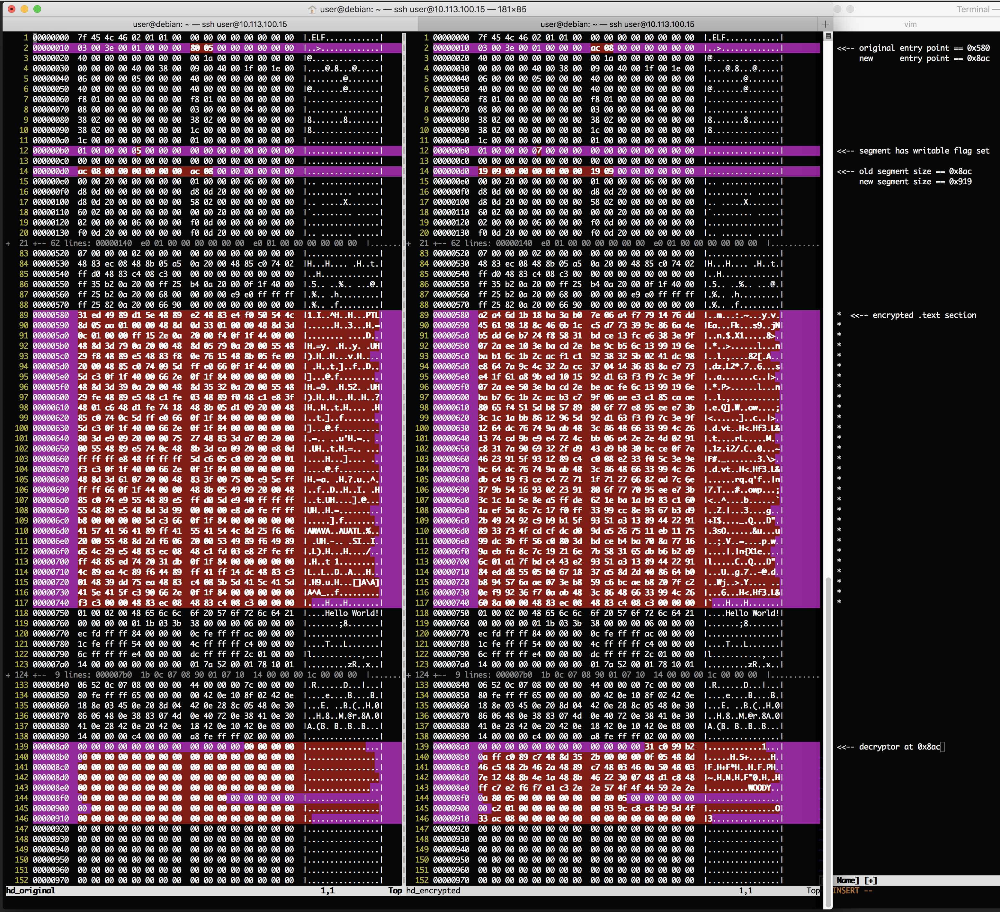

# woody-woodpacker

### _simple elf64 binary encryptor_


#### building:
`make`

#### usage:
`usage: ./woody_woodpacker [-d -k key] binary` produces a `woody` binary

#### logic:
   - find `.text` section, get file offset and size
   - find `LOAD` segment which contains the `.text` section
   - go to end of segment and check if there are enough null bytes to insert our decryptor
   - if yes, encrypt `.text` section, insert decryptor at the end of the segment, increase segment size
   - save entry point, start address and size of text section in decryptor
   - change entry point in elf header to point to decryptor


#### sample:

```
root@debian:/home/user/woody-woodpacker# cat hello.c 
#include <stdio.h>
int main()
{
	puts("Hello World!");
	return 0;
}
root@debian:/home/user/woody-woodpacker# gcc hello.c -o hello
root@debian:/home/user/woody-woodpacker# ./woody_woodpacker hello
encryption key = 0x334f9db9c8c89c93
root@debian:/home/user/woody-woodpacker# ./woody
..WOODY..
Hello World!
root@debian:/home/user/woody-woodpacker# 
```


##### here is a vimdiff of `hexdump -vC` output for original and encrypted binaries
[](intra/woody_hexdump_vimdiff.png "intra/woody_hexdump_vimdiff.png")
